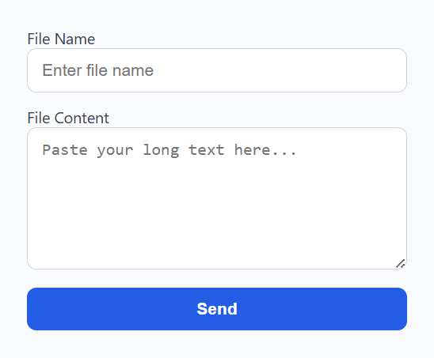

# ChatFile - Google Chat Long Text File Sender

**ChatFile** is a lightweight Chrome extension that allows you to send long messages in Google Chat and Gmail Chat by converting them into a virtual text file. This bypasses the 12,000-character limit and attaches the content as a file, ready to send.

---

## 🚀 Features

- Paste large text content and give it a filename
- Instantly creates a virtual `.txt` file
- Automatically attaches the file to the chat's file input
- Works on both `chat.google.com` and Gmail's embedded Chat (`mail.google.com`)

---

## 📦 Installation (Developer Mode)

1. Clone or download this repository.
2. Go to `chrome://extensions` in your browser.
3. Enable **Developer mode** (top right).
4. Click **"Load unpacked"** and select the extension folder.
5. Pin the extension for quick access.

---

## 🖼️ UI Preview




---


## Demo


---

## 🧪 How to Use

1. Open a chat conversation in **Google Chat** or **Gmail Chat**.
2. Click the ChatFile extension icon.
3. Enter:
   - **File Name**: (e.g., `meeting-notes.txt`)
   - **Long Text Content**: Paste your full message here.
4. Click **Send**.
5. The file will be attached to the current chat file input — just press **Enter** or click **Send**.

---

## 🔒 Permissions

| Permission                  | Why it's needed                            |
| --------------------------- | ------------------------------------------ |
| `activeTab`                 | To inject script into current chat tab     |
| `scripting`                 | To inject the virtual file into file input |
| `https://chat.google.com/*` | To access standalone Google Chat           |
| `https://mail.google.com/*` | To access embedded Gmail Chat              |

---

## 📁 Project Structure

```
google-chat-extension/
├── manifest.json # Chrome extension manifest
├── popup.html # Popup UI for input
├── popup.js # Handles form and injection logic
├── content.js # Optional for dynamic content filtering
└── README.md # You are here
```

---

## ⚠️ Limitations

- Chrome extensions cannot read the `#fragment` part of a URL in `manifest.json`, so we filter Gmail Chat using `location.hash` inside `content.js`.
- Make sure the chat window is open and active before clicking "Send".

---

## 📄 License

MIT License. Free for personal and commercial use.
