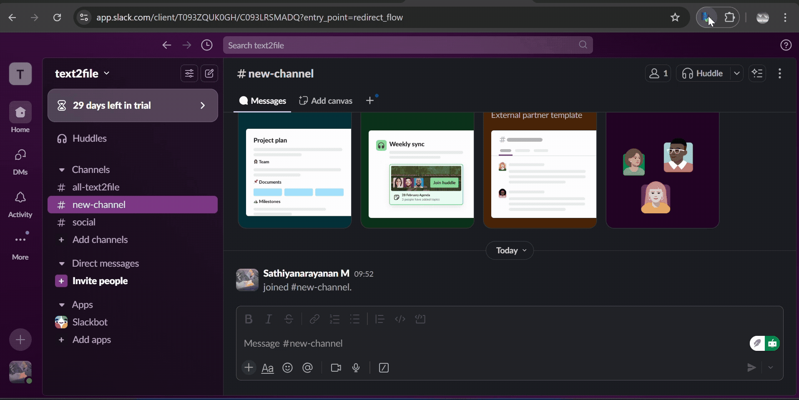
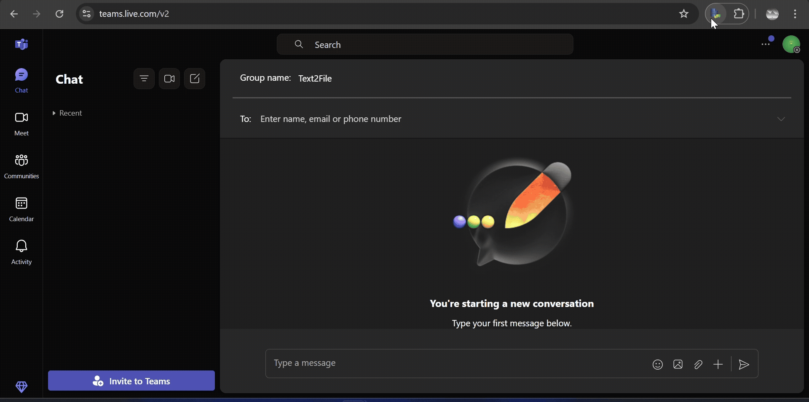

# Text2File - Long Text File Sender

**Text2File** is a lightweight Chrome extension that lets you send long messages by converting them into a downloadable file. It bypasses character limits by automatically attaching the content as a file — ready to send in apps like Google Chat, Slack, ChatGPT, etc.

---

## 🚀 Features

* Paste long text and give it a custom filename
* Instantly generates a virtual `.txt` file (or any custom extension)
* Automatically attaches the file to the file input field
* Works with any application that supports file uploads (e.g., Google Chat, Slack, ChatGPT, etc.)

---

## 📦 Installation (Developer Mode)

1. Clone or download this repository.
2. Go to `chrome://extensions` in your Chrome browser.
3. Enable **Developer mode** (toggle at the top right).
4. Click **“Load unpacked”** and select the extension folder.
5. Pin the extension icon for quick access.

---

## 🖼️ UI Preview

---

## 🧪 How to Use

1. Open the web application where you want to upload the file.
2. Click the **Text2File** extension icon.
3. Fill in the fields:

   * **File Name** (e.g., `meeting-notes.txt`)
   * **Long Text Content**: Paste your full message here
4. Click **Send**.
5. The file will be attached to the file input — simply press **Enter** or click **Send** in the app.

---

## 🔒 Permissions

| Permission  | Purpose                                           |
| ----------- | ------------------------------------------------- |
| `activeTab` | To inject the script into the current browser tab |
| `scripting` | To simulate the file upload behavior              |
| `storage`   | To save input data locally for reuse              |

---

## 🪧 Demo

* Demo on Google Chat:

* Demo on Slack:

* Demo on Teams:

> Note: Teams hides the file input by default. You may need to click the attachment icon first to reveal the file input so the extension can inject the file.

---

## 📄 License

MIT License — Free to use for both personal and commercial projects.
